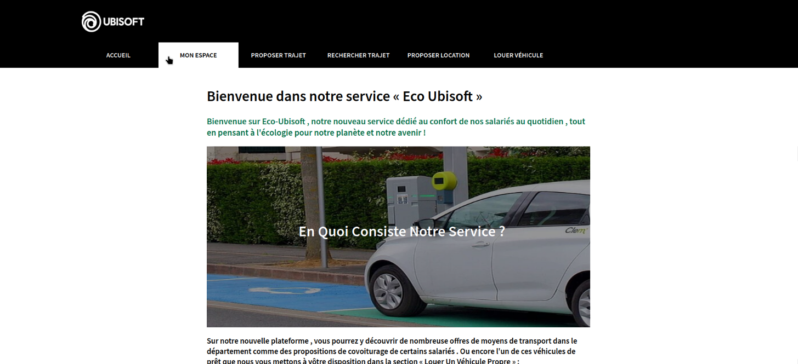

# EcoUbisoft

> Ce site a été réalisé par FRANCKELEMON Clément, AOULAD-TAYAB Karim

Un site web fictif dans lequel on présente un service proposé par Ubisoft qui sert la cause écologique (tels que le covoiturage, location de véhicules éléctriques, etc...) via une maquette. 

Toutes les pages présentes dans le site:
- **Accueil** : Présente le projet d'Ubisoft, avec les services proposés et leur objectifs.
- **Mon espace** : Page dans laquelel on accède à nos informations personnelles (enregistrement bancaire, historique des achats).
- **Proposer un trajet** : Service rémuneré qui permet à un employé Ubisoft de se tenir volontaire pour réaliser un trajet (service de covoiturage).
- **Rechercher un trajet** : L'inverse du service au-dessus, permet à un employé de chercher un trajet parmi ceux proposés.
- **Proposer une location** : Service permettant de faire louer un véhicule léger (trotinette, skate, vélo, etc...) ou un véhicule éléctrique.
- **Louer véhicule** : L'inverse du service au-dessus, permet à un employé de louer un véhicule qui est disponible en location.

